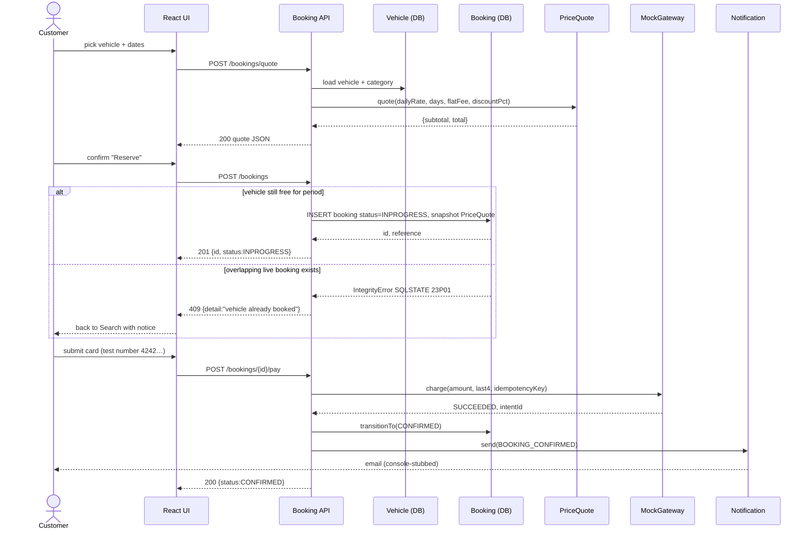

# 01 · Reserve and Pay (happy path)
Covers UC-10 Quote Rental Cost, UC-11 Reserve Vehicle, UC-14 Submit Payment, UC-15 Confirm Booking.

A logged-in Customer picks a vehicle and dates. The Booking service composes a `PriceQuote` snapshot (so later rate changes under F.R 5.3 can't retro-affect this booking), creates an INPROGRESS hold protected by the Postgres `EXCLUDE USING gist` constraint on `(vehicle_id, period)`, charges via the mock payment gateway, and on success transitions to CONFIRMED and emits a notification. The `alt` block shows what happens when another customer books the same window first (DB raises SQLSTATE `23P01` → HTTP 409).

