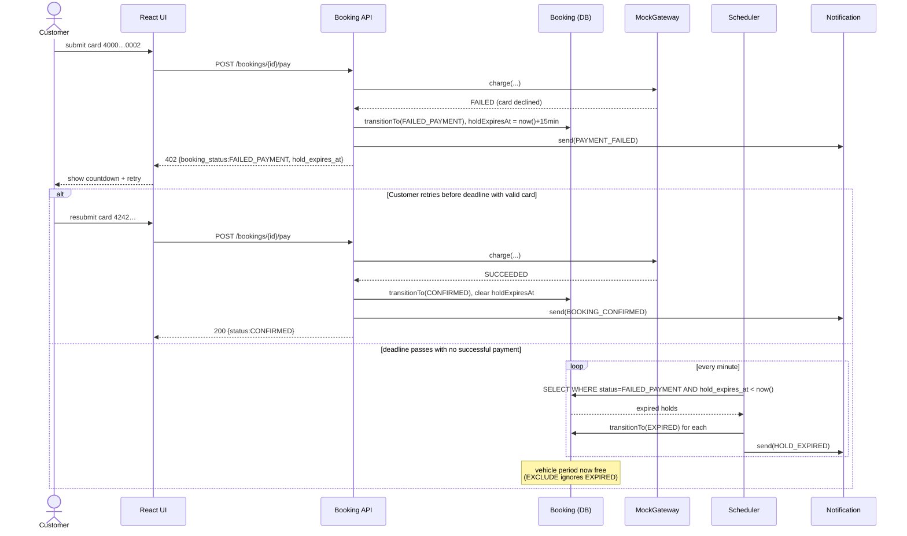

# 02 · Failed Payment & 15-min Expiry
Covers UC-14 Submit Payment (failure branch), UC-16 Expire Unpaid Hold.

When the mock gateway declines (test card `4000 0000 0000 0002`), the booking transitions INPROGRESS → FAILED_PAYMENT and `holdExpiresAt` is set to `now() + 15 min` — this is the moment the clock starts (locked per F.R 4.4). The Scheduler sweeps periodically; any FAILED_PAYMENT booking past its deadline flips to EXPIRED, releasing the vehicle (the EXCLUDE constraint only applies to live statuses, so EXPIRED frees the slot). The `alt` block shows the Customer retrying with a valid card before the deadline and recovering to CONFIRMED.

