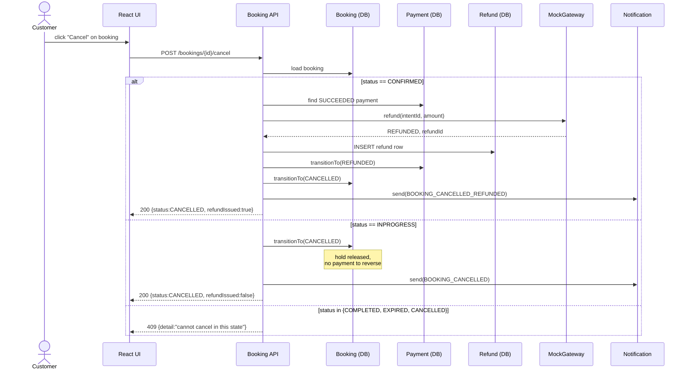

# 03 · Cancel & Refund
Covers UC-13 Cancel Booking, UC-17 Issue Refund (refund `extend`s cancel, correcting the arrow direction noted in open issue #2).

A Customer cancels a booking. The service branches on current status: cancelling a CONFIRMED booking issues a refund via the mock gateway (F.R 4.5); cancelling an INPROGRESS hold just releases the vehicle with no money movement. Both paths send a notification. Cancels are forbidden once status is COMPLETED or after pickup time (business rule from F.R 3.5).

