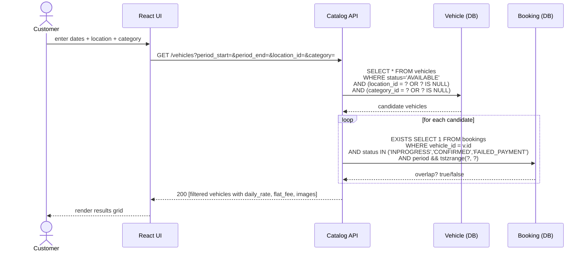

# 04 · Search Availability by Date & Location
Covers UC-7 Browse Vehicles, UC-9 Search Availability by Date & Location, F.R 2.3 / F.R 2.4.

Customer submits a pickup/return window plus optional location and category filters. The Catalog service returns only vehicles whose fleet status is AVAILABLE **and** which have no overlapping live booking for the requested period. The overlap check uses the Postgres `tstzrange` operator `&&` against the same column protected by the no-double-booking EXCLUDE constraint, so searches and bookings see a consistent definition of "available."

